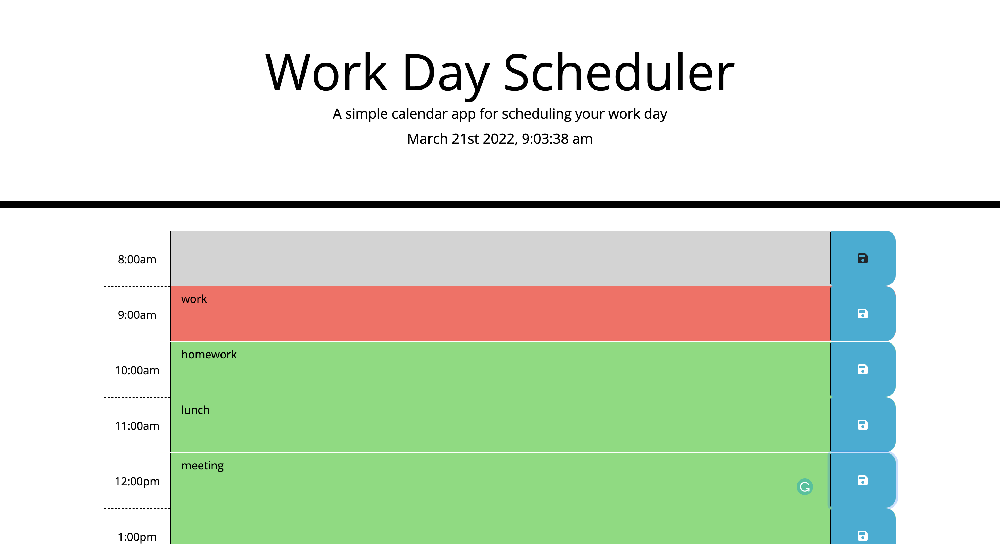

# Workday Scheduler

## Description

Do you ever feel like you need a place to store you're schedule without having to constantly carry a planner with you?  Now you can use this workday scheduer to plan out your day without the need for a planner.  This especially works for those who just need a little of organization in their life.

## Usage
In each hour slot, type in you're corresponding schedule and press the save button on the right.
When the hour changes, your plans accorrding to the hour will be color coded:

Grey for completed. 
Red for the current time block. 
And Green for the upcominng hour. 

https://tayhern.github.io/UCLA-Challenge-Workday-Scheduler/

## User Story
AS AN employee with a busy schedule  
I WANT to add important events to a daily planner  
SO THAT I can manage my time effectively  
